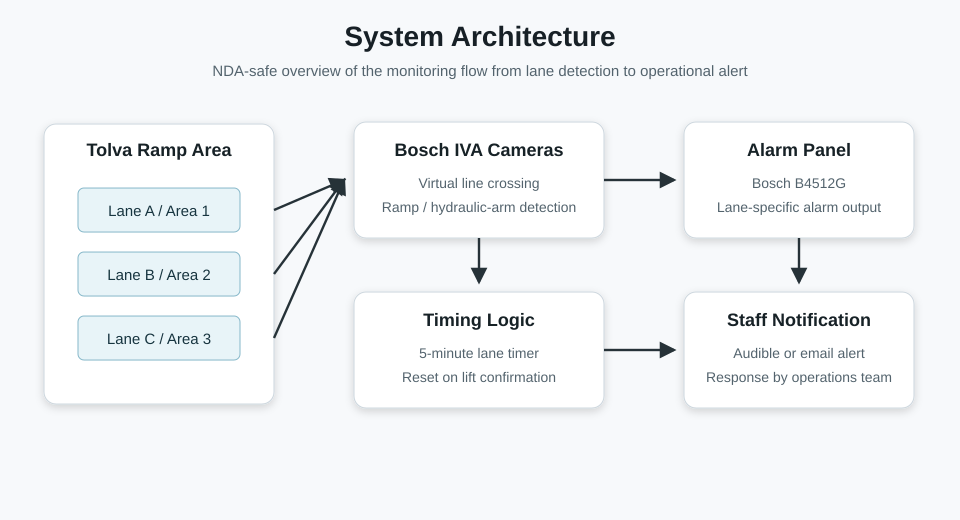
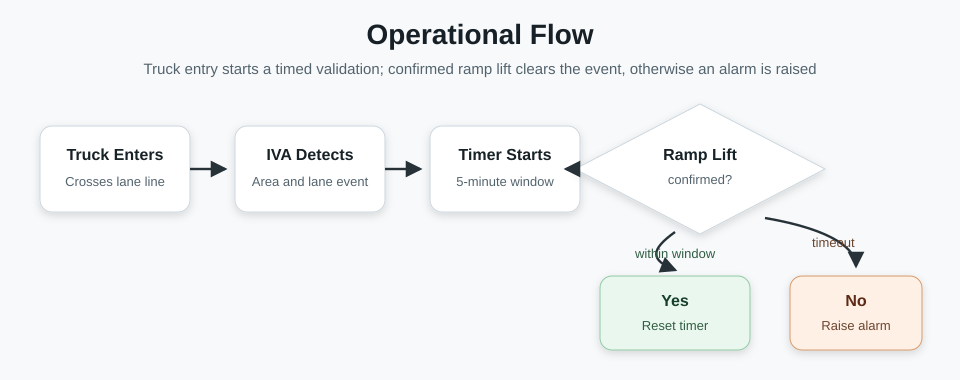

# Truck Ramp Lift Monitoring System

This repository documents a port operations monitoring project designed to detect trucks in the Tolva ramp area and raise an alarm when a truck enters a lane but the expected ramp lift/unloading confirmation does not happen within the defined time window.

The project combines Bosch IVA (Intelligent Video Analytics) camera rules, lane-specific detection areas, timing logic, and alarm-panel integration to automate a check that previously depended on manual observation. Its purpose is to improve operational safety and response time by confirming that trucks using the Tolva lanes complete the required lift/unloading step before the incident window expires.





---

## Project Context

The solution was implemented for a Tolva ramp zone in an industrial port environment. Each lane is monitored by a camera positioned to detect truck line crossing and the later visual confirmation of the ramp or hydraulic-arm state.

The original deployment focused on three operational goals:

1. Detect trucks crossing into each Tolva lane.
2. Start a 5-minute timer after the truck crossing is detected.
3. Trigger an alarm if the corresponding ramp is not lifted before the timer expires.

This makes the camera configuration part of a wider port safety workflow: the video analytics detect events in real time, while the alarm panel provides the operational alert for staff.

---

## System Components

| Component | Role |
|------------|------|
| Bosch IVA camera | Detects virtual line crossing and visual conditions in each lane. |
| Tolva lane areas | Logical areas assigned to each ramp lane: Tolva A, Tolva B, and Tolva C. |
| Bosch B4512G alarm panel | Starts the timer and generates the alarm output when the expected event does not occur. |
| Automatic timer | Runs for 5 minutes after a truck is detected entering a lane. |
| Email/alarm output | Notifies staff when a truck/ramp condition requires attention. |

---

## Overview

These scripts define the logic inside a Bosch IVA camera to automatically trigger alerts when:

1. A truck enters the Tolva area (`Entrada` task).
2. The truck is detected in the monitored Tolva/ramp zone (`Tolva` task).
3. The truck exits or reaches the monitored exit condition (`Salida` task).
4. The system checks whether the expected lift/unloading confirmation happened before the timeout.
   - If no confirmation occurred, an alert is generated.

---

## Operational Flow

1. **Lane assignment**
   - Tolva A is associated with Area 1.
   - Tolva B is associated with Area 2.
   - Tolva C is associated with Area 3.

2. **Truck entry detection**
   - When a truck enters its lane, it crosses a virtual line detected by the camera.

3. **Timer activation**
   - The Bosch B4512G panel starts a 5-minute countdown for the corresponding lane.

4. **Ramp/lift verification**
   - If the ramp is lifted before the timer expires, the hydraulic-arm/ramp condition is detected and the timer is reset.

5. **Alarm generation**
   - If the ramp is not lifted within 5 minutes, the panel triggers an alarm identifying the affected Tolva lane.

---

## Camera Rule Summary

| Task Name | Description |
|------------|--------------|
| **Entrada** | Detects truck crossing the entrance line into the Tolva zone. |
| **Tolva** | Detects truck presence inside the unloading/ramp area. |
| **Salida** | Detects truck exit or the configured exit condition for the Tolva area. |
| **Salida despues de descarga** | Confirms whether the truck completed the expected lift/unloading sequence. If not, an alert is triggered. |

---

## Results From Deployment

The deployment produced three main operational improvements:

- Faster response to incidents where a truck/ramp condition is not completed on time.
- Automated real-time monitoring of the Tolva lanes.
- Greater reliability compared with manual observation, especially when several lanes are active at once.

---

## Recommendations

Based on the deployment report, future improvements include:

- Fine-tuning camera positioning according to real operating conditions and detection performance.
- Training staff on alarm panel operation and alarm-handling procedures.
- Considering integration with other port security or operational systems.

---

## Email Notification Setup

The file `IVAAlarmTaskEditor` defines how the camera sends email alerts.

To enable email notifications:

1. Open Bosch Configuration Manager or VCA Task Editor.
2. In the Alarm Task Editor section, copy and paste the content of `IVAAlarmTaskEditor`.
3. Replace the placeholder values:

```text
IP("smtp.example.com")
From("camera@example.com")
Login("camera@example.com")
Password("APP_PASSWORD")
To("alerts@example.com")
```

4. Make sure that the sender email account supports SMTP, not POP3 or IMAP.
   - SMTP is required to send emails.
   - If your provider uses two-factor authentication, create an app-specific password.
5. Test the configuration by triggering a manual alert from the camera interface.

> Do not use POP3 or IMAP for sending alerts. These protocols are for receiving email. The camera must be configured with an SMTP sender account to send notifications automatically.

---

## Security & Best Practices

- Never commit real credentials to GitHub.
- Use placeholders such as `example.com` and `APP_PASSWORD` in configuration files.
- Keep SMTP credentials configured only on the camera or approved deployment environment.
- Ensure the email account supports TLS/STARTTLS for secure transmission.
- Validate detection geometry after any camera movement, lens adjustment, or lane-layout change.

---

## How to Import

1. Open Bosch IVA Task Editor.
2. Import or copy/paste:
   - `BoschIvaTaskEditor` under the IVA Tasks section.
   - `IVAAlarmTaskEditor` under Alarm Task Editor.
3. Adjust geometric coordinates such as `Field` and `Line` according to the camera position and Tolva lane layout.
4. Apply and save the configuration to the camera.
5. Test each lane independently by simulating entry, lift confirmation, and timeout conditions.

---

## License

MIT License - free to use and modify.
Attribution appreciated but not required.
